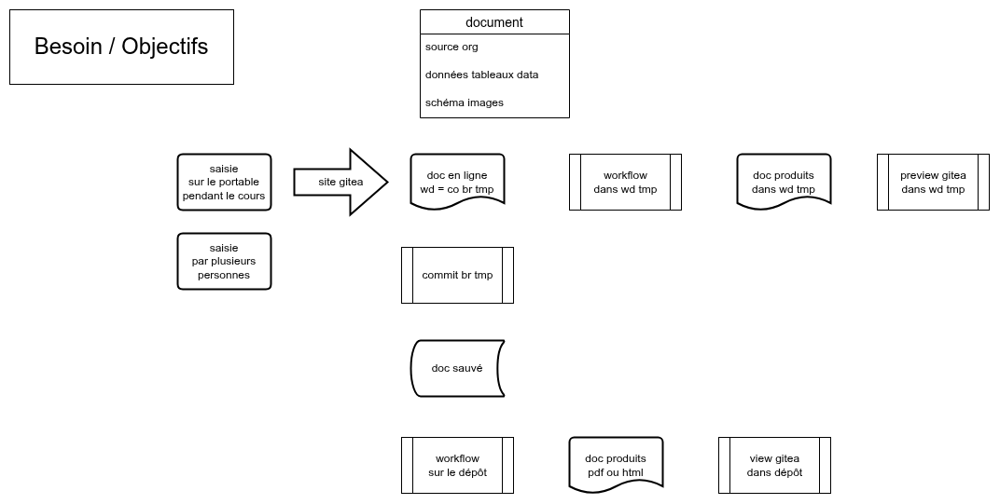

#+TITLE: Atelier sciences
#+LANGUAGE: fr
#+LATEX_CLASS: article
#+LATEX_CLASS_OPTIONS: [french,a4paper,natural,usenames,svgnames]
#+LATEX_HEADER: \usepackage{svg}
# Custom Ansible language definition:
#+latex_header: \input{.latex/listings-ansible.tex}
#+OPTIONS: toc:2 num:3 H:4 ^:nil pri:t
# Custom css file for org-mode
#+HTML_HEAD: <link rel="stylesheet" type="text/css" href="org.css"/>

(c) Michel Briand, 2025-2026, licence CC BY-SA 4.0.

* Introduction

Concevoir et implémenter un environnement de travail simple et
efficace à destination des étudiants en sciences.

Le premier objectif est de gérer les prises de notes en cours,
les fiches de révision et les devoirs à produire.

L'atelier peut être étendu aux besoins des professeurs et chercheurs.

Les objectifs sont de gérer des projets documentaires incluant
rapport, bibliographie, présentation et publication scientifique.

* Besoin

Liste succincte de l'état de l'art...

 - Solutions disponibles en ligne :
   * Overleaf (propriétaire)
   * CoCalc (propriétaire)
   * TeXlyre (libre)
 - Articles proposant des idées, une analyse, une solution :
   * https://blog.martisak.se/2020/05/11/gitlab-ci-latex-pipeline/
   * https://framatube.org/w/4SkerQToa4k99fhaUk4WHS
 - tbc

#+CAPTION:   Présentation générale de l'atelier
#+NAME:      fig:INTRO
#+ATTR_HTML: :align center :width 100%

** L'interface du quotidien

Saisie des cours, et prises de notes sans contrainte.
Bac à sable. Interface web.

** L'interface gui locale : emacs

Le meilleur compromis entre gui et cli.
 - emacs + C-c C-e
 - script ou Makefile

** La notion de projet-type

Projet-type = structure (préfabriquée) qui identifie clairement les
outils, les processus, les sources, les objets intermédiaires et les
produits. Le tout versionné.

** Automatisations

Permet la reproductibilité.

automatisation CI/CD : gitea runner

- récupérer les bonnes sources
- gérer le cache
- gérer les produits (artifacts)
- Le job travaille sur des fichiers préparés pour lui par le runner (réceptionne les ordres amonts). Checkout (clone) ou NFS, ou?

* Analyse

** Interface

État de l'Art : Overleaf, CoCal, Gitea, article de Martin Isaksson,
mon package, ...

https://blog.martisak.se/2020/05/11/gitlab-ci-latex-pipeline/

Interface web : gitea. La plus simple à mettre en œuvre.

** Choix des outils

** Choix de la stratégie d'accès aux sources

Pourquoi passer par le réseau (compliqué) alors qu'on est censé
exécuter un runner sur le même serveur (dans ce cas simple). Ne
pourrait-on pas monter le répertoire des dépôts dans le job runner ?

git clone / checkout via protocole réseau, via montage (=-v=)

NFS ?

** Choix relatifs aux processus élémentaires

Découper les tâches en tâches élémentaires.

On peut déterminer la tâche à effectuer en fonction de :

- le nom du document 
- le nom de l'extension du document 
- des mots clés trouvés à l'intérieur du document 

Il faut trouver la méthode qui génère le moins d'ambiguïté ou le plus
d'inambiguïté 

* Implémentation

bottom-up : tâches élémentaires, make, pipeline
top-bottom : projet(s), document(s), , produits

** Interface

** Conteneur

- création d'un conteneur pour act_runner (exécuteur gitea)
  gestion des jobs
  
  répertoire =container/gitea-act_runner=
  fichier =compose.yml=

création d'un conteneur avec emacs pour produire les documents

Accès aux outils / scripts :

: -v tools:/tools

** Orchestration système

- création d'un pod pour mettre tout ça ensemble
- création d'un service systemd pour le pod

*** TODO/bugs

**** git submodules pour publius/org...

Quand le conteneur est lancé avec -v (mount), les liens symboliques ne
marchent pas. Il faut un répertoire pour les outils (mount)
spécifique, ou un clone/checkout (submodule?) pour les fichiers Make
et Emacs.

**** adresser le conteneur emacs

NFS
port? envoyer des commandes?
solution socket?

*** Conteneur sur le même serveur : git clone via mount

Accès aux sources :

NFS ?

créons un conteneur qui utilise le répertoire local de gitea
et le monte (via services)

: podman run -it --name testgitlocal -v /var/lib/gitea/data/gitea-repositories:/repos:ro fb5e48a0afc7 /bin/bash

dans le conteneur :

: git clone /repos/publius/atelier_sciences.git

*** secret podman

création d'un secret avec podman :

: echo 'montoken' | podman secret create atelier_sciences_runner_token -

#+begin_src shell
  podman run \
         -e GITEA_INSTANCE_URL=https://https://kheb.ignorelist.com:3000 \
         -e GITEA_RUNNER_REGISTRATION_TOKEN=$my_token \
         -v /var/run/docker.sock:/var/run/docker.sock \
         --name r_atelier_sciences \
         docker.io/gitea/act_runner:latest
#+end_src

*** workflow gitea

#+begin_src yaml
name: Gitea Actions Demo
run-name: ${{ gitea.actor }} is testing out Gitea Actions 🚀
on: [push]

jobs:
  Explore-Gitea-Actions:
    runs-on: ubuntu-latest
    steps:
      - run: echo "🎉 The job was automatically triggered by a ${{ gitea.event_name }} event."
      - run: echo "🐧 This job is now running on a ${{ runner.os }} server hosted by Gitea!"
      - run: echo "🔎 The name of your branch is ${{ gitea.ref }} and your repository is ${{ gitea.repository }}."
      - name: Check out repository code
        uses: actions/checkout@v4
      - run: echo "💡 The ${{ gitea.repository }} repository has been cloned to the runner."
      - run: echo "🖥️ The workflow is now ready to test your code on the runner."
      - name: List files in the repository
        run: |
          ls ${{ gitea.workspace }}
      - run: echo "🍏 This job's status is ${{ job.status }}."
#+end_src

